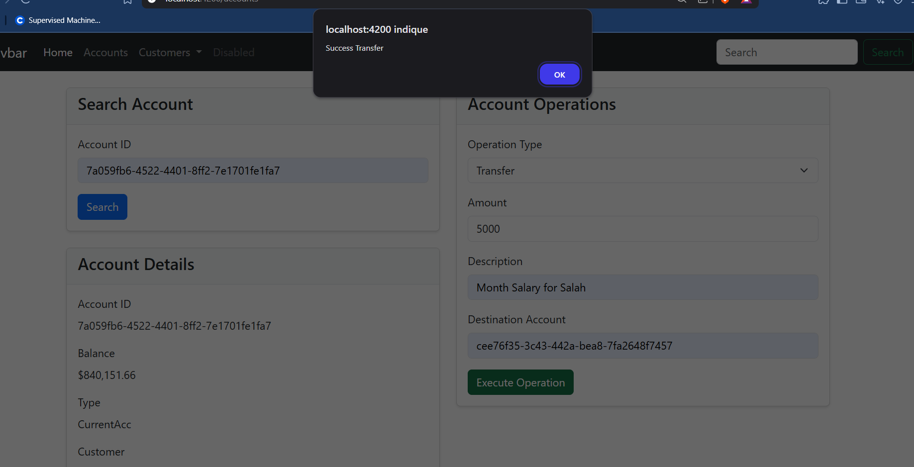

# E-Bank Backend

<h1 align="center">
  <a href="https://github.com/mreckah">
    
  </a>
</h1>
<p align="center">
  &nbsp;    
  <a target="_blank" href="https://www.linkedin.com/in/nabbar-oussama/">
    
  </a>
  <a href="mailto:m.reckahwalt@gmail.com" target="_blank" onclick="window.open(this.href,'_blank'); return false;">
    
  </a>
  <a target="_blank" href="https://github.com/mreckah">
    
  </a>
</p>
## 📋 Table of Contents

1. [Project Description](#project-description)
2. [Features](#features)
3. [Project Structure](#project-structure)
4. [Technical Stack](#technical-stack)
5. [Installation & Setup](#installation--setup)
6. [Components Documentation](#components-documentation)
7. [How It Works](#how-it-works)

## Project Description

Digital Banking Frontend is a modern, responsive web application built with Angular that provides a comprehensive interface for managing bank accounts, customers, and banking operations. The application offers an intuitive user experience with real-time updates and seamless navigation.

## Features

### Core Banking Features

- **Customer Management**
  - View all customers
  - Search customers by name or ID
  - Add new customers
  - Update customer information
  - Delete customers

- **Account Management**
  - View all accounts
  - Search accounts by ID, type, or customer
  - View detailed account information
  - Track account balance and status
  - Monitor overdraft limits and interest rates

- **Banking Operations**
  - Perform deposits (Credit)
  - Process withdrawals (Debit)
  - Execute transfers between accounts
  - View transaction history
  - Access account statements

## Project Structure

```
DigitalBank-front/
├── src/
│   ├── app/
│   │   ├── accounts/           # Account management components
│   │   │   ├── accounts.component.ts
│   │   │   ├── accounts.component.html
│   │   │   └── accounts.component.css
│   │   ├── customers/          # Customer management components
│   │   ├── services/           # API services
│   │   │   ├── accounts.service.ts
│   │   │   └── customers.service.ts
│   │   ├── model/             # Data models
│   │   │   ├── account.model.ts
│   │   │   └── customer.model.ts
│   │   └── shared/            # Shared components and utilities
│   ├── assets/                # Static assets
│   └── environments/          # Environment configurations
└── package.json
```

## Technical Stack

- **Framework**: Angular 17
- **UI Framework**: Bootstrap 5
- **State Management**: RxJS
- **Forms**: Reactive Forms
- **HTTP Client**: Angular HttpClient
- **Styling**: CSS3 with Bootstrap
- **Build Tool**: Angular CLI

## Installation & Setup

1. **Clone the Repository**
   ```bash
   git clone https://github.com/mreckah/DigitalBanking-front.git
   cd DigitalBanking-front
   ```

2. **Install Dependencies**
   ```bash
   npm install
   ```

3. **Configure Environment**
   ```typescript
   // environment.ts
   export const environment = {
     production: false,
     apiUrl: 'http://localhost:8080'
   };
   ```

4. **Start Development Server**
   ```bash
   ng serve
   ```

5. **Access the Application**
   - Open your browser and navigate to `http://localhost:4200`


## How It Works

### 1. Customer Management

#### View All Customers
- Access the Customers section
- Browse through customer list
- Use search functionality
- View customer details


#### Customer Operations
- Add new customers
- Update customer information
- View customer's accounts
- Delete customers (if no active accounts)


### Result  


### 1. Account Management

#### Account Operations
- Select an account
- Choose operation type (Debit/Credit/Transfer)
- Enter amount and description
- Confirm operation
- View updated balance and transaction history




- 🔙 **Backend Repository**: 
> 🔗 This frontend connects to the [Digital Banking Backend](https://github.com/mreckah/E-Bank-backend), a Spring Boot REST API handling all core banking logic and data management.
